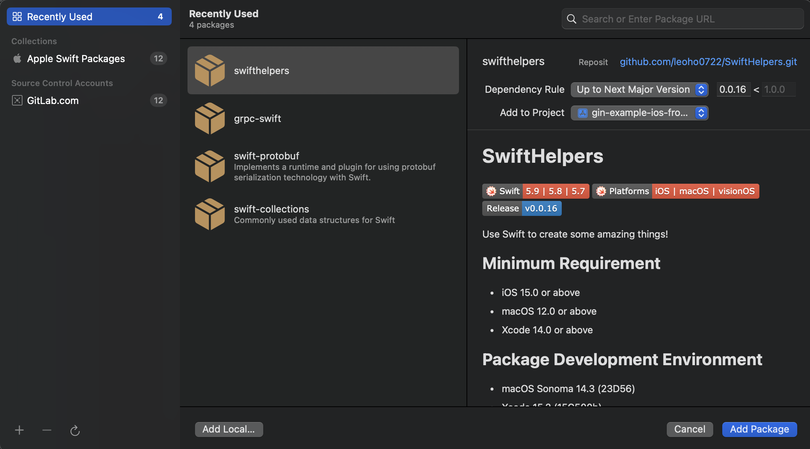

# SwiftHelpers

[](https://swiftpackageindex.com/leoho0722/SwiftHelpers)
[](https://swiftpackageindex.com/leoho0722/SwiftHelpers)


Use Swift to create some amazing things!

## Minimum OS Requirement

* iOS 15.0 or above
* macOS 12.0 or above

## Package Development Environment

* macOS Sonoma 14.2.1 (23C71)
* Xcode 15.1 (15C65)
* Swift 5.9

## Install

Currently only installation using Swift Package Manager is supported.

```git
https://github.com/leoho0722/SwiftHelpers.git
```



## How to use

### Example: Convert to JSON Data

```swift
import Foundation
import SwiftHelpers

func createURLRequest<E>(with url: URL,
                         method: HTTP.HTTPMethod,
                         parameters: E) -> URLRequest where E: Encodable {
    var request = URLRequest(url: url)
    request.httpMethod = method.rawValue
    request.allHTTPHeaderFields = [
        HTTP.HTTPHeaderFields.contentType.rawValue : HTTP.HTTPContentType.json.rawValue
    ]
    
    if method != .get {
        request.httpBody = try? JSON.toJsonData(data: parameters)
    }
    
    return request
}
```

### Example: Safely use SF Symbols with UIKit and AppKit and SwiftUI

#### UIKit

```swift
import SwiftHelpers
import UIKit

class ViewController: UIViewController {
    
    private let imageView = UIImageView()

    override func viewDidLoad() {
        super.viewDidLoad()
        imageView.image = UIImage(symbols: .applelogo) // Use SwiftHelpers
        // imageView.image = UIImage(systemName: "applelogo") // Use UIKit
        view.addSubView(imageView)
        
        // ...
    }
}
```

#### AppKit

```swift
import Cocoa
import SwiftHelpers

class ViewController: NSViewController {
    
    private let imageView = NSImageView()
    
    override func viewDidLoad() {
        super.viewDidLoad()
        imageView.image = NSImage(symbols: .applelogo) // Use SwiftHelpers
        // imageView.image = NSImage(systemSymbolName: "applelogo", accessibilityDescription: nil) // Use AppKit
        view.addSubView(imageView)
        
        // ...
    }

    override var representedObject: Any? {
        didSet {
            // Update the view, if already loaded.
        }
    }
}
```

#### SwiftUI

```swift
import SwiftHelpers
import SwiftUI

struct ContentView: View {
    
    var body: some View {
        Image(symbols: .applelogo) // Use SwiftHelpers
        // Image(systemName: "applelogo") // Use SwiftUI
        
        Label("Safely use SF Symobols with SwiftUI", symbols: .applelogo) // Use SwiftHelpers
        // Label("Use SF Symobols with SwiftUI", systemImage: "applelogo") // Use SwiftUI
        
        // ...
    }
}
```
